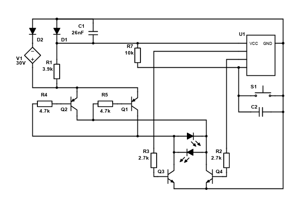
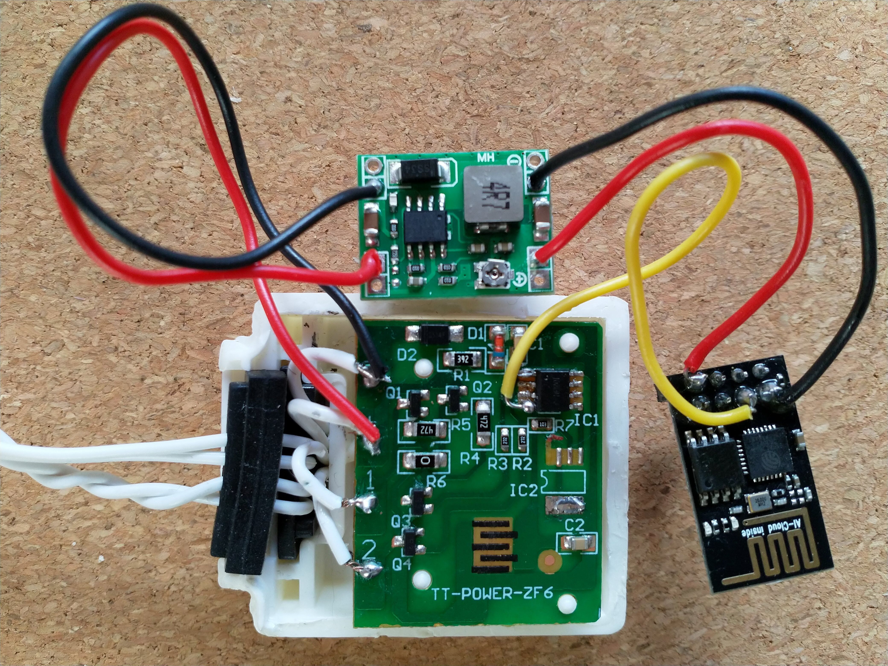

# Introduction

Last year I bought a string of Central Park outdoor X-mas lights that I used to decorate my back yard. I plugged it into an outdoor socket that I could control with an indoor switch, so I could switch the lights on or off without having to go outside. The lights feature seven different blink modes, from cheesy to annoying, and a "normal" mode where all lights are constantly on. That's the only mode I want. You can cycle through the modes by pressing the button on a small integrated control box.


# The Problem

What I didn't realize is that the default mode is the most annoying one of all, a bad medley of all it's other blink modes. So every time I'd switch on the lights from inside the house, I'd have step out and press the control button seven times to get to the normal mode (the last one in the cycle, naturally). Because it was a very rainy winter, I couldn't be bothered to switch on the lights half of the nights.

# The Solution

So instead I decided to fix the problem. I opened the control box, cutting through the glue that held the two halves together, and "reverse engineered" the schematics of the very simple controller circuit. I'm not an electronics engineer, so please take this with a grain of salt.

The controller circuit features an IC that controls two pairs of transistors that each send 30V to the lights, but opposite polarity. All lights (LEDs) are connected in parallel, half of them in one direction and the other half in the opposite direction. So each transistor pair controls half of the lights. The IC switches the transistors on and off (never on simulataneously of course) to create the various blinking patterns. In the normal, unblinking mode it switches the transistors with 230Hz, too fast for our eyes to notice.



I decided to use a wifi enabled microcontroller to emulate button (S1) presses (pulling pin 3 of the IC to ground). On startup, the microcontroller could simply "push the button" seven times to get the lights into their normal, unblinking mode.

I could probably have used the microcontroller to replace the built-in IC entirely, but emulating button presses was simpler. Perhaps one day I'll come back and replace the IC, so I can design my own blink patterns (yay).

By using a wifi enabled microcontroller, I can also use my phone to switch to a different blink pattern if I want. Not very useful, but I got the wifi part basically for free anyway.

## Hardware

Because I wanted to fit everything inside the original controller casing, I've used the smallest components that I could find.

I've used an [ESP-01S module](https://www.tinytronics.nl/shop/en/communication-and-signals/wireless/wi-fi/modules/esp8266-wifi-module-esp-01-1mb)  (on the right in the picutre) that combines a ESP8266 with 1MB of memory. It works just as well with a ESP-01 module (actually, that's what I used initially until I roasted it by feeding it 5V). It has a serial (UART) interface for uploading firmware (no USB on board), so I used an [ESP link programmer](https://www.tinytronics.nl/shop/en/communication-and-signals/serial/usb/esp-link-esp8266-esp-01(s)-programmer) to program it over USB.

The control box receives 30V DC from the power supply that's integrated into the plug. I've used a tiny [MP1584 adjustable buck converter] to step the voltage down to the 3.3V that the ESP-01S expects. It's rated for max 28V input, but I took my chances with 30V because I couldn't quickly find a higher rated converter with a comparably small footprint.

I've connected the input side of of the power converter (top) to the incoming wires in the control box (bottom), and the output side to the PWR and GND pins of the ESP (right). I've connected the IO2 pin of the ESP to pin 4 (closest to R7) of the IC on the controller board.



## Software

I've used [ESPHome](https://esphome.io/) to build and upload the firmware, and to make the device available in my [Home Assistant](https://www.home-assistant.io/), so I can change the blink pattern with a button in the Home Assistant app on my phone.

See [xmaslights.yml](esphome/xmaslights.yml) for the complete configuration. To build and upload the firmware I use:

```
esphome -s ssid mywifi -s wifi_pw mypass -s ota_pw myotapass -s api_pw myapipw run xmaslights.yml
```

Because it won't be easy to reconfigure the ESP after I seal it inside the control box, I've enabled ESPHome's fallback access point with the [captive portal](https://esphome.io/components/captive_portal.html).